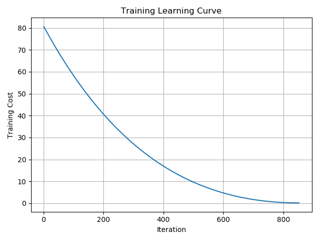
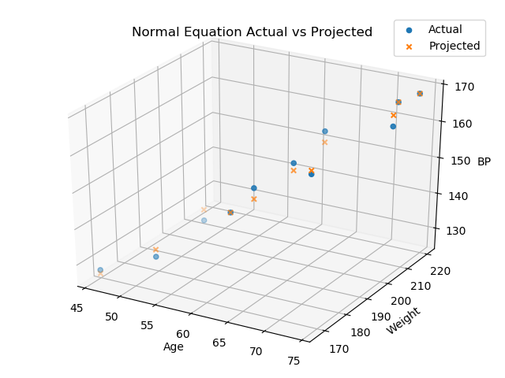

Linear Regresssion from scratch

## Dataset
The simple cengage systolic blood pressure dataset:  
https://college.cengage.com/mathematics/brase/understandable_statistics/7e/students/datasets/mlr/frames/frame.html

## Purpose
Gain familiarity with the algorithm by developing it from scratch.
Hence, best ML practices such as train/test/cross-validation splits 
are NOT prioritized.

#### Run verified with python 3.7 and numpy 1.18.1
python Runner.py

## Visualize

### Min-Max Normalized
(data - min) / (max - min)  
Puts feature data and labels within [0, 1] range  

## Training Learning Curve

## Trained Model

## Normal Equation Trained Model

## Actual vs Projected

## Normal Equation Actual vs Projected

