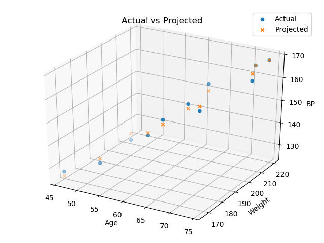

Linear Regresssion for the simple cengage systolic blood pressure dataset:

https://college.cengage.com/mathematics/brase/understandable_statistics/7e/students/datasets/mlr/frames/frame.html

## Visualize

### Min-Max Normalized
(data - min) / (max - min)  
Puts feature data and labels within [0, 1] range  

## Training Learning Curve

## Trained Model

## Actual vs Projected

